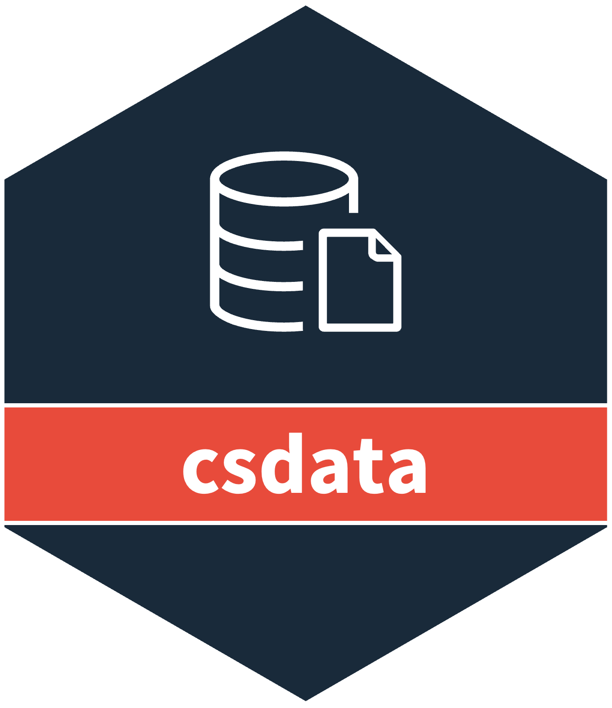

# csdata <a href="https://www.csids.no/csdata/"></a>

## Overview 

[csdata](https://www.csids.no/csdata/) contains preformatted structural data for Norway.

Datasets relating to population in municipalities, municipality/county matching, and how different municipalities have merged/redistricted over time from 2006 to 2020.

Read the introduction vignette [here](http://www.csids.no/csmaps/articles/csdata.html) or run `help(package="csdata")`.

## csverse

<a href="https://www.csids.no/packages.html"></a>

The [csverse](https://www.csids.no/packages.html) is a set of R packages developed to help solve problems that frequently occur when performing infectious disease surveillance.

If you want to install the dev versions (or access packages that haven't been released on CRAN), run `usethis::edit_r_profile()` to edit your `.Rprofile`. 

Then write in:

```
options(
  repos = structure(c(
    CSVERSE = "https://www.csids.no/drat/",
    CRAN    = "https://cran.rstudio.com"
  ))
)
```

Save the file and restart R.

You can now install [csverse](https://www.csids.no/packages.html) packages from our [drat repository](https://www.csids.no/drat/).

```
install.packages("csdata")
```

