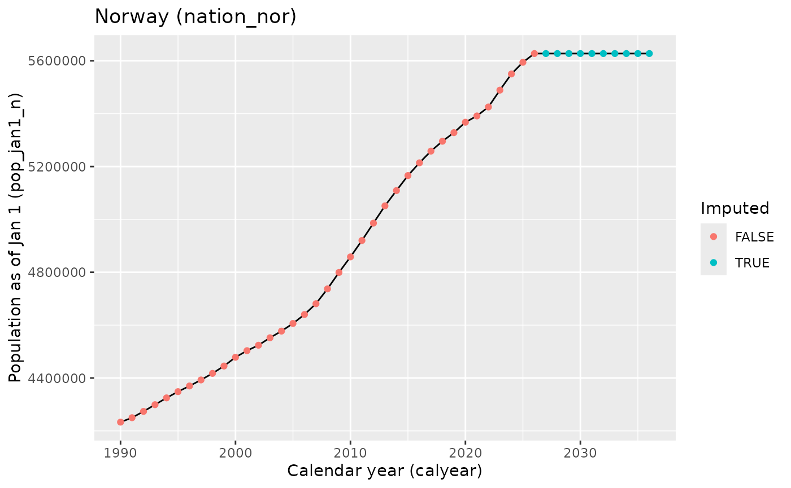

# Population (Norway)

Populations are available in
[`csdata::nor_population_by_age_cats()`](https://niphr.github.io/csdata/reference/nor_population_by_age_cats.md).

``` r
pd <- csdata::nor_population_by_age_cats()[granularity_geo %in% "nation" & calyear>=1990]

q <- ggplot(pd, aes(x=calyear, y = pop_jan1_n))
q <- q + geom_line()
q <- q + geom_point(mapping = aes(color = imputed))
q <- q + scale_x_continuous("Calendar year (calyear)")
q <- q + scale_y_continuous("Population as of Jan 1 (pop_jan1_n)")
q <- q + scale_color_discrete("Imputed")
q <- q + labs(title = "Norway (nation_nor)")
q
```



Here we list as a reference table the valid populations as of January
1st (`pop_jan1_n`).

| Reference table of calyear and pop_jan1_n (nation and georegion) |                    |                          |                       |            |         |                      |
|------------------------------------------------------------------|--------------------|--------------------------|-----------------------|------------|---------|----------------------|
|                                                                  | Norge-Noreg-Norway | Nord-Norge-Davvi-Norggas | Trøndelag-Trööndelage | Vestlandet | Agder   | Østlandet-Austlandet |
| 2005                                                             | 4.606.363          | 462.625                  | 404.812               | 1.177.616  | 264.872 | 2.284.672            |
| 2006                                                             | 4.640.219          | 462.777                  | 407.883               | 1.198.059  | 266.401 | 2.305.109            |
| 2007                                                             | 4.681.134          | 462.232                  | 411.641               | 1.209.117  | 268.461 | 2.329.675            |
| 2008                                                             | 4.737.171          | 462.031                  | 416.567               | 1.224.684  | 272.074 | 2.361.819            |
| 2009                                                             | 4.799.252          | 463.436                  | 421.124               | 1.241.760  | 275.592 | 2.397.359            |
| 2010                                                             | 4.858.199          | 465.623                  | 425.782               | 1.259.760  | 278.876 | 2.428.136            |
| 2011                                                             | 4.920.305          | 468.262                  | 429.931               | 1.278.247  | 282.456 | 2.461.419            |
| 2012                                                             | 4.985.870          | 470.757                  | 435.065               | 1.294.779  | 285.819 | 2.499.440            |
| 2013                                                             | 5.051.275          | 474.556                  | 440.861               | 1.314.728  | 289.125 | 2.531.991            |
| 2014                                                             | 5.109.056          | 478.135                  | 444.961               | 1.331.743  | 292.225 | 2.561.992            |
| 2015                                                             | 5.165.802          | 480.743                  | 449.384               | 1.346.948  | 295.644 | 2.593.085            |
| 2016                                                             | 5.213.985          | 482.001                  | 453.356               | 1.357.916  | 298.486 | 2.622.244            |
| 2017                                                             | 5.258.317          | 484.638                  | 458.216               | 1.364.902  | 300.789 | 2.649.758            |
| 2018                                                             | 5.295.619          | 485.996                  | 462.355               | 1.369.542  | 303.754 | 2.673.969            |
| 2019                                                             | 5.328.212          | 486.452                  | 465.632               | 1.373.738  | 305.244 | 2.697.141            |
| 2020                                                             | 5.367.580          | 484.546                  | 468.702               | 1.381.659  | 307.231 | 2.725.440            |
| 2021                                                             | 5.391.369          | 482.513                  | 471.124               | 1.387.010  | 308.843 | 2.741.879            |
| 2022                                                             | 5.425.270          | 481.926                  | 474.131               | 1.392.937  | 311.134 | 2.765.142            |
| 2023                                                             | 5.488.984          | 483.536                  | 478.470               | 1.406.924  | 316.051 | 2.804.007            |
| 2024                                                             | 5.550.203          | 487.744                  | 482.956               | 1.421.340  | 319.850 | 2.838.313            |
| 2025                                                             | 5.594.340          | 489.103                  | 486.815               | 1.432.119  | 322.188 | 2.864.115            |
| 2026                                                             | 5.627.400          | 489.778                  | 489.166               | 1.440.433  | 323.930 | 2.884.093            |
| 2027                                                             | 5.627.400          | 489.778                  | 489.166               | 1.440.433  | 323.930 | 2.884.093            |
| 2028                                                             | 5.627.400          | 489.778                  | 489.166               | 1.440.433  | 323.930 | 2.884.093            |
| 2029                                                             | 5.627.400          | 489.778                  | 489.166               | 1.440.433  | 323.930 | 2.884.093            |
| 2030                                                             | 5.627.400          | 489.778                  | 489.166               | 1.440.433  | 323.930 | 2.884.093            |
| 2031                                                             | 5.627.400          | 489.778                  | 489.166               | 1.440.433  | 323.930 | 2.884.093            |
| 2032                                                             | 5.627.400          | 489.778                  | 489.166               | 1.440.433  | 323.930 | 2.884.093            |
| 2033                                                             | 5.627.400          | 489.778                  | 489.166               | 1.440.433  | 323.930 | 2.884.093            |
| 2034                                                             | 5.627.400          | 489.778                  | 489.166               | 1.440.433  | 323.930 | 2.884.093            |
| 2035                                                             | 5.627.400          | 489.778                  | 489.166               | 1.440.433  | 323.930 | 2.884.093            |
| 2036                                                             | 5.627.400          | 489.778                  | 489.166               | 1.440.433  | 323.930 | 2.884.093            |

| Reference table of calyear and pop_jan1_n (county) |         |          |          |                     |                     |                 |                     |             |
|----------------------------------------------------|---------|----------|----------|---------------------|---------------------|-----------------|---------------------|-------------|
|                                                    | Agder   | Akershus | Buskerud | Finnmark-Finnmárkku | Innlandet-Sisdajven | Møre og Romsdal | Nordland-Nordlándda | Oslo-Oslove |
| 2005                                               | 264.872 | 535.804  | 223.853  | 73.074              | 356.710             | 238.454         | 235.389             | 529.846     |
| 2006                                               | 266.401 | 543.132  | 225.183  | 72.937              | 356.885             | 242.410         | 234.859             | 538.411     |
| 2007                                               | 268.461 | 551.350  | 227.367  | 72.665              | 356.969             | 242.847         | 234.079             | 548.617     |
| 2008                                               | 272.074 | 561.324  | 230.429  | 72.399              | 358.072             | 244.275         | 233.652             | 560.484     |
| 2009                                               | 275.592 | 570.848  | 233.344  | 72.492              | 359.556             | 246.271         | 234.058             | 575.475     |
| 2010                                               | 278.876 | 579.994  | 236.200  | 72.856              | 361.057             | 248.785         | 234.928             | 586.860     |
| 2011                                               | 282.456 | 589.763  | 239.185  | 73.417              | 362.696             | 251.385         | 235.966             | 599.230     |
| 2012                                               | 285.819 | 600.980  | 242.966  | 73.787              | 364.679             | 254.113         | 237.036             | 613.285     |
| 2013                                               | 289.125 | 611.813  | 246.174  | 74.534              | 365.649             | 256.972         | 238.326             | 623.966     |
| 2014                                               | 292.225 | 621.848  | 248.857  | 75.207              | 366.785             | 259.130         | 239.622             | 634.463     |
| 2015                                               | 295.644 | 631.576  | 250.935  | 75.605              | 368.358             | 261.340         | 240.405             | 647.676     |
| 2016                                               | 298.486 | 641.783  | 253.383  | 75.758              | 368.636             | 262.914         | 240.630             | 658.390     |
| 2017                                               | 300.789 | 652.222  | 254.974  | 76.149              | 369.893             | 263.847         | 241.605             | 666.759     |
| 2018                                               | 303.754 | 662.452  | 256.539  | 76.167              | 370.994             | 264.422         | 242.071             | 673.469     |
| 2019                                               | 305.244 | 672.781  | 257.677  | 75.865              | 371.054             | 264.967         | 242.126             | 681.071     |
| 2020                                               | 307.231 | 682.092  | 259.626  | 75.472              | 371.385             | 265.236         | 241.235             | 693.494     |
| 2021                                               | 308.843 | 689.561  | 260.962  | 74.684              | 370.603             | 265.544         | 240.345             | 697.010     |
| 2022                                               | 311.134 | 701.565  | 262.911  | 74.129              | 371.253             | 265.848         | 240.190             | 699.827     |
| 2023                                               | 316.051 | 716.020  | 267.060  | 74.112              | 373.628             | 268.369         | 241.084             | 709.037     |
| 2024                                               | 319.850 | 728.803  | 269.819  | 75.053              | 376.304             | 270.624         | 243.081             | 717.710     |
| 2025                                               | 322.188 | 740.680  | 271.248  | 75.042              | 377.556             | 272.413         | 243.582             | 724.290     |
| 2026                                               | 323.930 | 749.207  | 272.981  | 75.288              | 379.488             | 273.169         | 243.272             | 728.714     |
| 2027                                               | 323.930 | 749.207  | 272.981  | 75.288              | 379.488             | 273.169         | 243.272             | 728.714     |
| 2028                                               | 323.930 | 749.207  | 272.981  | 75.288              | 379.488             | 273.169         | 243.272             | 728.714     |
| 2029                                               | 323.930 | 749.207  | 272.981  | 75.288              | 379.488             | 273.169         | 243.272             | 728.714     |
| 2030                                               | 323.930 | 749.207  | 272.981  | 75.288              | 379.488             | 273.169         | 243.272             | 728.714     |
| 2031                                               | 323.930 | 749.207  | 272.981  | 75.288              | 379.488             | 273.169         | 243.272             | 728.714     |
| 2032                                               | 323.930 | 749.207  | 272.981  | 75.288              | 379.488             | 273.169         | 243.272             | 728.714     |
| 2033                                               | 323.930 | 749.207  | 272.981  | 75.288              | 379.488             | 273.169         | 243.272             | 728.714     |
| 2034                                               | 323.930 | 749.207  | 272.981  | 75.288              | 379.488             | 273.169         | 243.272             | 728.714     |
| 2035                                               | 323.930 | 749.207  | 272.981  | 75.288              | 379.488             | 273.169         | 243.272             | 728.714     |
| 2036                                               | 323.930 | 749.207  | 272.981  | 75.288              | 379.488             | 273.169         | 243.272             | 728.714     |

| Reference table of calyear and pop_jan1_n (county) |          |          |              |                       |          |          |         |
|----------------------------------------------------|----------|----------|--------------|-----------------------|----------|----------|---------|
|                                                    | Rogaland | Telemark | Troms-Romssa | Trøndelag-Trööndelage | Vestfold | Vestland | Østfold |
| 2005                                               | 384.984  | 166.289  | 154.162      | 404.812               | 214.295  | 554.178  | 257.875 |
| 2006                                               | 397.594  | 166.140  | 154.981      | 407.883               | 215.639  | 558.055  | 259.719 |
| 2007                                               | 404.566  | 166.170  | 155.488      | 411.641               | 217.338  | 561.704  | 261.864 |
| 2008                                               | 412.687  | 166.731  | 155.980      | 416.567               | 219.970  | 567.722  | 264.809 |
| 2009                                               | 420.574  | 167.548  | 156.886      | 421.124               | 222.675  | 574.915  | 267.913 |
| 2010                                               | 427.947  | 168.231  | 157.839      | 425.782               | 224.820  | 583.028  | 270.974 |
| 2011                                               | 436.087  | 169.185  | 158.879      | 429.931               | 227.211  | 590.775  | 274.149 |
| 2012                                               | 443.115  | 170.023  | 159.934      | 435.065               | 229.843  | 597.551  | 277.664 |
| 2013                                               | 452.159  | 170.902  | 161.696      | 440.861               | 232.178  | 605.597  | 281.309 |
| 2014                                               | 459.625  | 171.469  | 163.306      | 444.961               | 234.280  | 612.988  | 284.290 |
| 2015                                               | 466.302  | 171.953  | 164.733      | 449.384               | 236.061  | 619.306  | 286.526 |
| 2016                                               | 470.175  | 172.494  | 165.613      | 453.356               | 238.363  | 624.827  | 289.195 |
| 2017                                               | 472.024  | 173.307  | 166.884      | 458.216               | 240.395  | 629.031  | 292.208 |
| 2018                                               | 473.526  | 173.391  | 167.758      | 462.355               | 242.386  | 631.594  | 294.738 |
| 2019                                               | 475.654  | 173.318  | 168.461      | 465.632               | 244.393  | 633.117  | 296.847 |
| 2020                                               | 479.892  | 173.355  | 167.839      | 468.702               | 246.041  | 636.531  | 299.447 |
| 2021                                               | 482.645  | 173.534  | 167.484      | 471.124               | 248.348  | 638.821  | 301.861 |
| 2022                                               | 485.797  | 173.970  | 167.607      | 474.131               | 250.862  | 641.292  | 304.754 |
| 2023                                               | 492.350  | 175.546  | 168.340      | 478.470               | 253.555  | 646.205  | 309.161 |
| 2024                                               | 499.417  | 177.093  | 169.610      | 482.956               | 256.432  | 651.299  | 312.152 |
| 2025                                               | 504.496  | 177.863  | 170.479      | 486.815               | 258.071  | 655.210  | 314.407 |
| 2026                                               | 508.922  | 177.923  | 171.218      | 489.166               | 259.332  | 658.342  | 316.448 |
| 2027                                               | 508.922  | 177.923  | 171.218      | 489.166               | 259.332  | 658.342  | 316.448 |
| 2028                                               | 508.922  | 177.923  | 171.218      | 489.166               | 259.332  | 658.342  | 316.448 |
| 2029                                               | 508.922  | 177.923  | 171.218      | 489.166               | 259.332  | 658.342  | 316.448 |
| 2030                                               | 508.922  | 177.923  | 171.218      | 489.166               | 259.332  | 658.342  | 316.448 |
| 2031                                               | 508.922  | 177.923  | 171.218      | 489.166               | 259.332  | 658.342  | 316.448 |
| 2032                                               | 508.922  | 177.923  | 171.218      | 489.166               | 259.332  | 658.342  | 316.448 |
| 2033                                               | 508.922  | 177.923  | 171.218      | 489.166               | 259.332  | 658.342  | 316.448 |
| 2034                                               | 508.922  | 177.923  | 171.218      | 489.166               | 259.332  | 658.342  | 316.448 |
| 2035                                               | 508.922  | 177.923  | 171.218      | 489.166               | 259.332  | 658.342  | 316.448 |
| 2036                                               | 508.922  | 177.923  | 171.218      | 489.166               | 259.332  | 658.342  | 316.448 |
